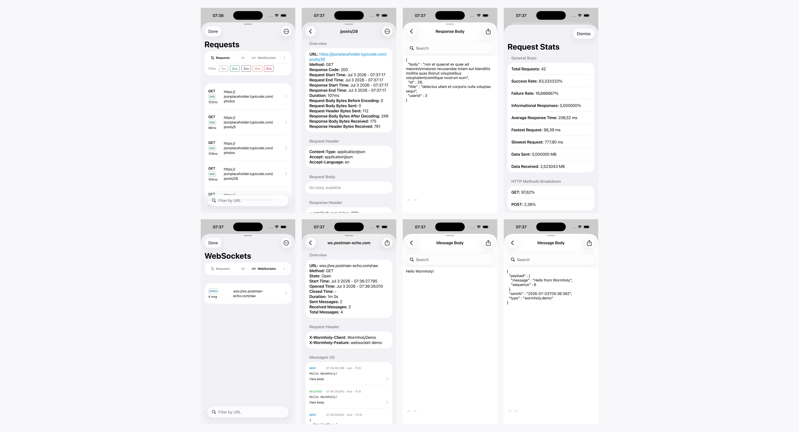
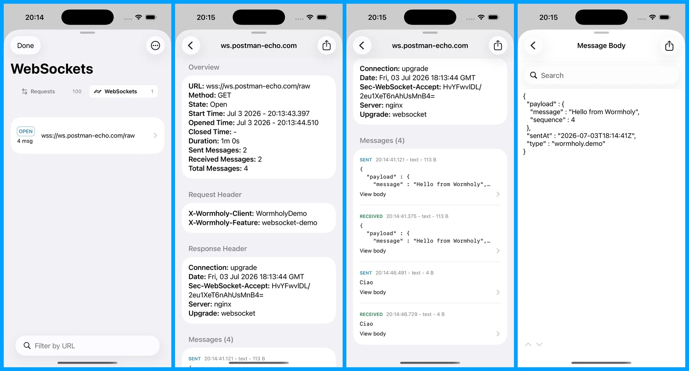

<p align="center">
  
</p>

[]()
[](https://cocoapods.org/pods/Wormholy)
[](https://swift.org/package-manager/)

Start debugging iOS network calls like a wizard, without extra code! Wormholy makes debugging quick and reliable.

**Features:**

- [x] No code to write and no imports.
- [x] Record all app traffic that uses `NSURLSession`.
- [x] Track native WebSocket traffic (`URLSessionWebSocketTask`), including sent and received messages, request headers, close codes, close reasons, and errors.
- [x] Inspect HTTP requests and WebSocket connections from separate views.
- [x] Reveal the content of all requests, responses, headers, and WebSocket messages simply by shaking your phone!
- [x] No headaches with SSL certificates on HTTPS calls.
- [x] Find, isolate, and fix bugs quickly.
- [x] Swift & Objective-C compatibility.
- [x] Also works with external libraries like `Alamofire` & `AFNetworking`.
- [x] Ability to blacklist hosts from being recorded using the array `ignoredHosts`.
- [x] Ability to export API requests as a Postman collection.
- [x] Ability to share cURL representations of API requests.
- [x] Ability to share WebSocket connection details as a text export.
- [x] Programmatically enable or disable Wormholy for specific session configurations.
- [x] Control the shake gesture activation with the `shakeEnabled` property.
- [x] Filter responses by status code for precise debugging.
- [x] View request stats, including HTTP methods breakdown, status code distribution, error types, response size stats, and more.

<p align="center">
  
  <br/>
  
</p>

## Requirements

- iOS 16.0+ (Need an older version? [Please use version 1.7.x](https://github.com/pmusolino/Wormholy/releases/tag/1.7.0))
- Xcode 15+
- Swift 5

## Usage

Integrating Wormholy into your project is simple, and it works like magic! **Shake your device** or simulator to access Wormholy. There's no need to import the library into your code.

<u>**It is recommended to install it only in debug mode and not integrate it into production. Please remove it before sending your apps to production.**</u> The easiest way to do this is with CocoaPods:

```shell
pod 'Wormholy', :configurations => ['Debug']
```

You can also integrate Wormholy using the **Swift Package Manager**!

### Configuration Options

- **Ignored Hosts**: Specify hosts to be excluded from logging using `Wormholy.ignoredHosts`. This is useful for ignoring traffic to certain domains, and applies to both HTTP requests and WebSocket connections.
- **Logging Limit**: Control the number of logs retained with `Wormholy.limit`. This helps manage memory usage by limiting the amount of data stored. The configured value is applied separately to HTTP requests and WebSocket connections.
- **WebSocket Message Limit**: Use `Wormholy.webSocketMessageLimit` to cap the number of messages retained per WebSocket connection. When the limit is reached, Wormholy removes the oldest messages and keeps the most recent ones. Set it to `0` to retain no messages; negative, non-finite, and `nil` values are treated as `nil`. Fractional values are truncated toward zero, and positive values beyond `Int.max` are clamped. Changes apply to subsequently recorded messages. The default `nil` value keeps the complete message history.
- **Default Filter**: Set a default filter for the search box with `Wormholy.defaultFilter` to streamline your debugging process.
- **Enable/Disable HTTP Tracking**: Use `Wormholy.setEnabled(_:)` to toggle HTTP request tracking globally. You can also enable or disable it for specific `URLSessionConfiguration` instances using `Wormholy.setEnabled(_:sessionConfiguration:)`.
- **Enable/Disable WebSocket Tracking**: Use `Wormholy.setWebSocketEnabled(_:)` to toggle native `URLSessionWebSocketTask` tracking. WebSocket tracking is independent from HTTP tracking and is disabled by default.
- **Shake Gesture**: Control the activation of Wormholy via shake gesture with `Wormholy.shakeEnabled`.
- **Status Check**: Use `Wormholy.isWormholyEnabled()` to inspect whether global Wormholy tracking is currently enabled.

### Example Configuration

```swift
func configureWormholy() {
  Wormholy.ignoredHosts = ["example.com", "analytics.internal"]
  Wormholy.limit = 200
  Wormholy.webSocketMessageLimit = 500
  Wormholy.defaultFilter = "status:500"
  Wormholy.shakeEnabled = true

  // Global tracking for URLSession traffic.
  Wormholy.setEnabled(true)

  // Optional: enable native URLSessionWebSocketTask tracking.
  Wormholy.setWebSocketEnabled(true)

  // Use the session-specific API when you want to override behavior
  // for a particular configuration instance.
  let configuration = URLSessionConfiguration.default
  Wormholy.setEnabled(false, sessionConfiguration: configuration)

  let session = URLSession(configuration: configuration)
  _ = session
}
```

### Notes on Session Configurations

Wormholy automatically hooks `URLSessionConfiguration.default` and `URLSessionConfiguration.ephemeral`.

Use `Wormholy.setEnabled(_:sessionConfiguration:)` when you want to explicitly enable or disable Wormholy for a specific configuration instance before creating the `URLSession`:

```swift
let configuration = URLSessionConfiguration.ephemeral
Wormholy.setEnabled(false, sessionConfiguration: configuration)
let session = URLSession(configuration: configuration)
```

Background sessions are a separate case: Apple does not support custom `URLProtocol` classes with background `URLSessionConfiguration`, so Wormholy cannot be injected there via `protocolClasses`.

### WebSocket Tracking

Wormholy can also capture native `URLSessionWebSocketTask` traffic with no third-party WebSocket library. This is **off by default**, unlike HTTP tracking:

```swift
Wormholy.setWebSocketEnabled(true)
```

Once enabled, use the "Requests" / "WebSockets" segmented control at the top of the Wormholy screen to switch views and inspect captured WebSocket connections.

Enable WebSocket tracking before creating WebSocket tasks. Existing tasks cannot be attached retroactively. Delegate-backed `URLSession` instances are also proxied only when they are created while tracking is enabled, so enable tracking before creating the session to capture delegate open and close events.

Wormholy can capture:

- Connection URL.
- Request headers, when the task is created with `URLRequest`.
- Response headers from the handshake, when available.
- Requested WebSocket protocols.
- Negotiated protocol, when available.
- Sent and received text/data messages.
- Message timestamps.
- Open and close events, when available.
- Close code and close reason.
- Errors.

WebSocket details include an overview, request headers, response headers when available, sent/received messages, full message body inspection, and text export/share.

It works with both the completion-handler and `async`/`await` APIs (`try await task.send(...)`), and requires no change to how you send or receive messages.

To capture custom WebSocket request headers, create the task with `URLRequest` instead of only `URL`:

```swift
var request = URLRequest(url: URL(string: "wss://example.com/socket")!)
request.setValue("Bearer token", forHTTPHeaderField: "Authorization")

let task = URLSession.shared.webSocketTask(with: request)
task.resume()
```

#### WebSocket Limitations

- `send`, `receive`, `cancel`, and message capture work for WebSocket tasks created through the swizzled `URLSession` factories while WebSocket tracking is enabled.
- Real `didOpen` / `didClose` events are captured through a lightweight `URLSession` delegate proxy, so they require sessions created with `URLSession(configuration:delegate:delegateQueue:)`.
- WebSocket traffic created with `URLSession.shared` can still capture messages, but may not provide real open/close delegate callbacks.
- WebSocket handshake response headers are not guaranteed and are only shown when available.

#### Demo App

The `WormholyDemo` app includes a WebSocket console that connects to [Postman's public WebSocket echo service](https://blog.postman.com/introducing-postman-websocket-echo-service/) (`wss://ws.postman-echo.com/raw`, no signup required) to exercise this end-to-end.

From the demo app you can:

- Open a WebSocket connection.
- Close the active connection.
- Open a new WebSocket, closing the active one.
- Send custom text messages.
- Send a sample JSON message to test pretty-printed body inspection.
- Toggle test request headers.
- Inspect the captured connection in Wormholy.
- Share/export the captured WebSocket details.

### Notes on Ignored Hosts

`Wormholy.ignoredHosts` uses suffix matching on the request host, and applies to both HTTP requests and WebSocket connections.

For example, if you set:

```swift
Wormholy.ignoredHosts = ["example.com"]
```

Wormholy will ignore HTTP traffic and WebSocket connections to both `example.com` and subdomains such as `api.example.com` / `wss://api.example.com`.

### Triggering Wormholy

If you prefer not to use the shake gesture, you can disable it using the [environment variable](https://medium.com/@derrickho_28266/xcode-custom-environment-variables-681b5b8674ec) `WORMHOLY_SHAKE_ENABLED` = `NO`.

To trigger Wormholy manually from another point in your app without using the shake gesture, post the `wormholy_fire` notification. This opens the same inspector UI used for HTTP requests and WebSocket connections:

```swift
NotificationCenter.default.post(name: NSNotification.Name(rawValue: "wormholy_fire"), object: nil)
```

By following these steps and configurations, you can effectively integrate Wormholy into your development workflow, enhancing your ability to debug network requests efficiently.

## Contributing

- If you **need help** or you'd like to **ask a general question**, open an issue.
- If you **found a bug**, open an issue.
- If you **have a feature request**, open an issue.
- If you **want to contribute**, submit a pull request.

## Acknowledgements

**Made with ❤️ by [Paolo Musolino](https://github.com/pmusolino).**

***Follow me on:***
#### 💼 [LinkedIn](https://www.linkedin.com/in/paolomusolino/)
#### 🤖 [X](https://x.com/pmusolino)

## MIT License

Wormholy is available under the MIT license. See the LICENSE file for more information.
